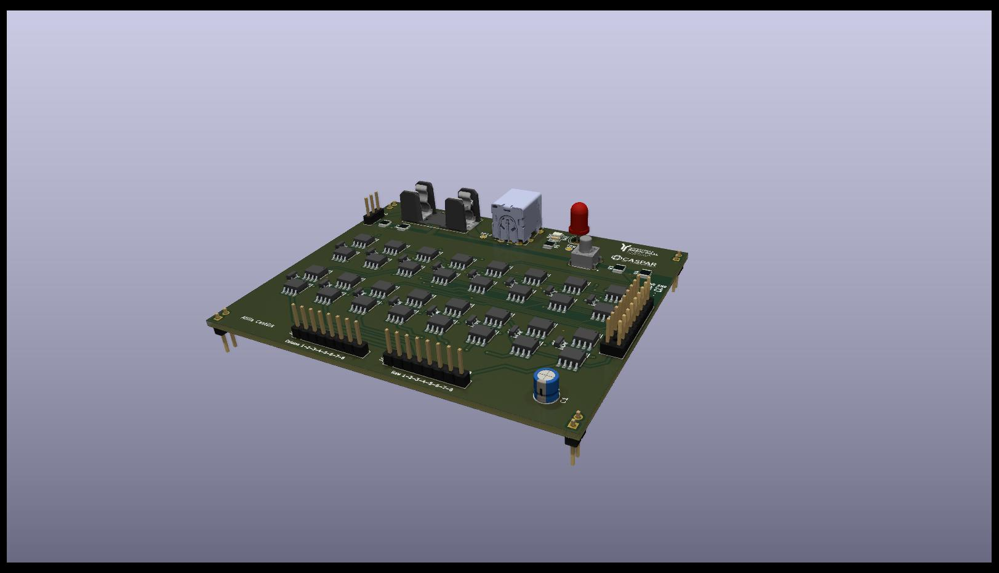
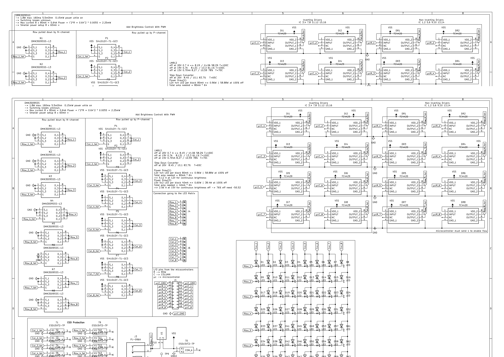

# 8×8 LED Matrix Control Shield

This repository contains the hardware design files for an 8×8 LED matrix controller capable of driving 64 LEDs at 15 V. The design was created using KiCad and includes all necessary files for review, modification, and fabrication.

---

## Overview

- 8×8 LED matrix control (64 LEDs)
- Designed for 15 V LED operation
- Fully custom PCB layout
- Suitable for applications such as visual interfaces, experimental setups, or embedded systems

---

## Repository Contents

- **KiCad Project Files**  
  Schematic and PCB layout files for editing and further development.

- **Gerber Files**  
  Ready-to-manufacture files for PCB fabrication.

- **Images**  
  Rendered views and design previews of the board and schematics.

---

## PCB Render (Assembled View)



---

## Schematic



---

## PCB Layout

### Top Layer


### Bottom Layer


---

## Getting Started

1. Clone the repository:
   ```bash
   git clone <your-repo-url>